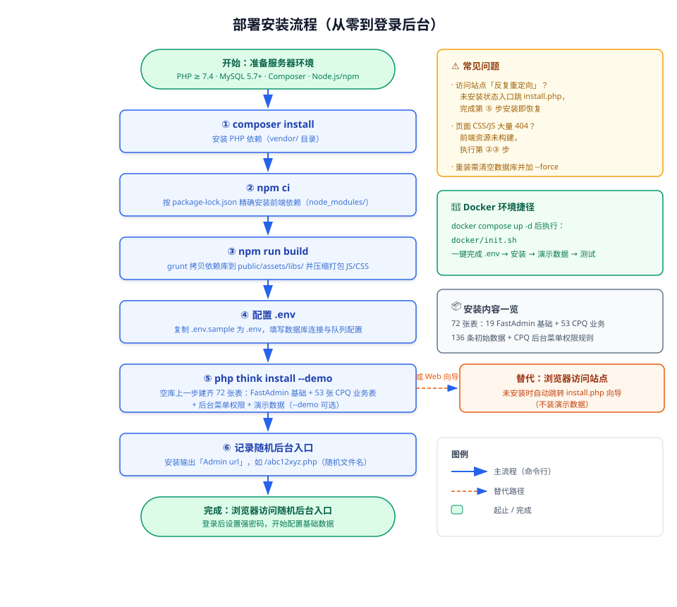
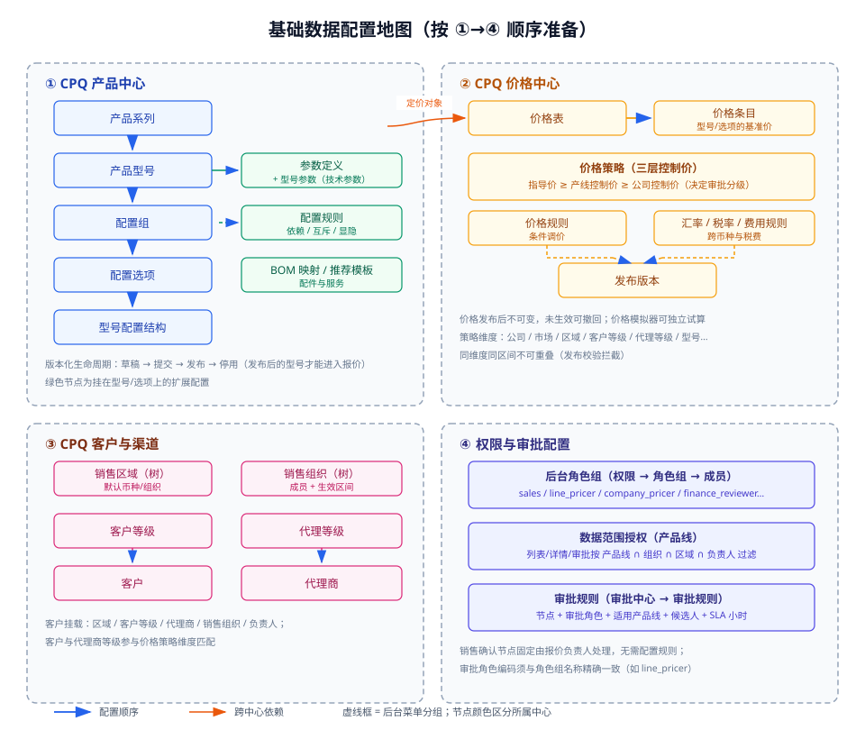
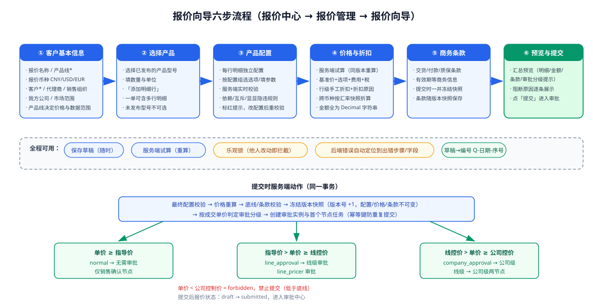
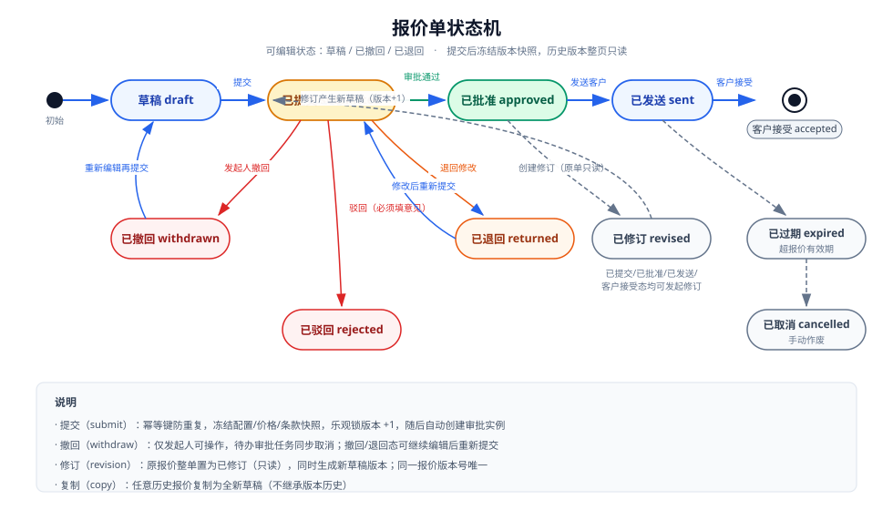
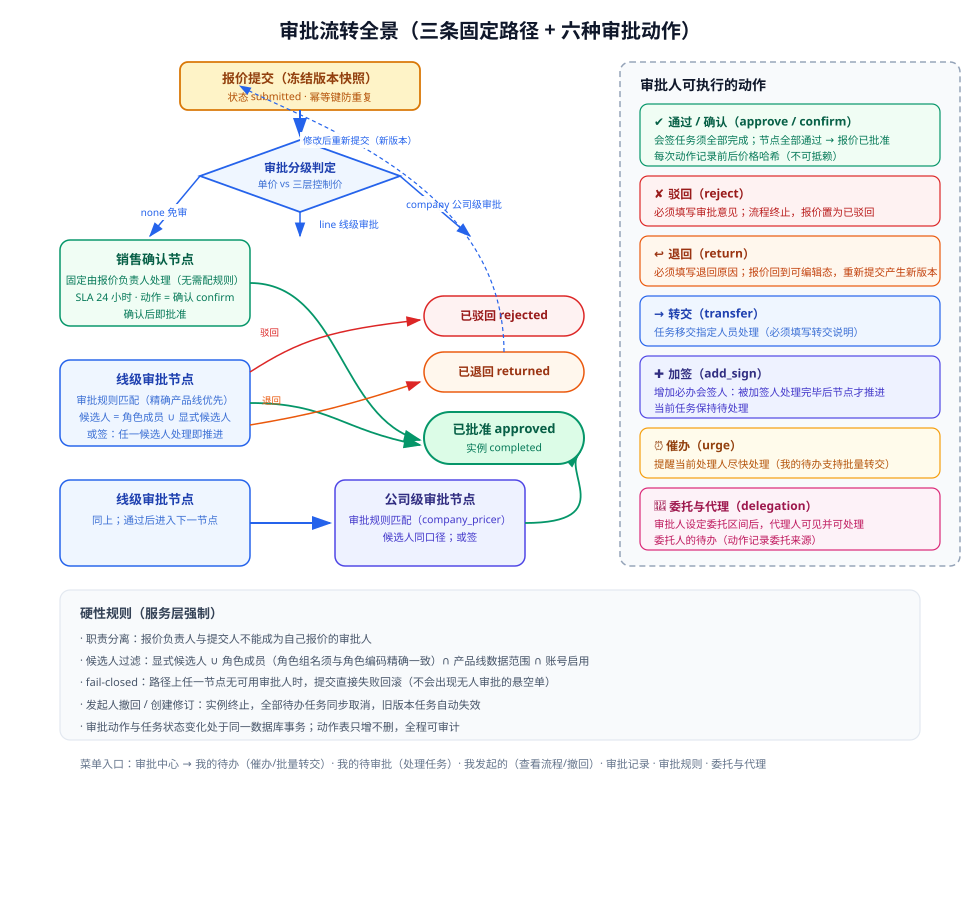

# FastAdmin-CPQ 报价系统使用说明书

> 从零安装 → 基础配置 → 创建报价 → 完成审批的完整操作指南。
> 依据代码库实际实现编写（菜单结构来自 `MenuRuleService`，流程来自 `Quote` / `ApprovalService` / `PricingService` 等服务层源码）。

---

## 目录

1. [系统简介](#1-系统简介)
2. [部署与安装](#2-部署与安装)
3. [初始配置](#3-初始配置)
4. [基础数据配置](#4-基础数据配置)
5. [创建报价（六步向导）](#5-创建报价六步向导)
6. [报价审批](#6-报价审批)
7. [审批之后：打印与报表](#7-审批之后打印与报表)
8. [常见问题](#8-常见问题)

---

## 1. 系统简介

本系统是在 FastAdmin（ThinkPHP 5 + Bootstrap 3 后台框架）上构建的 **CPQ（Configure-Price-Quote，配置-定价-报价）系统**，覆盖「产品建模 → 三层定价 → 报价配置 → 审批流转 → 打印输出 → 经营分析」全流程。

安装完成后，后台左侧菜单将出现七个 CPQ 中心：

| 菜单 | 主要功能 | 典型使用者 |
| --- | --- | --- |
| **CPQ 产品中心** | 产品系列/型号、参数、配置组/选项、配置规则、BOM 映射、产品配置器 | 产品经理、主数据管理员 |
| **CPQ 价格中心** | 价格表/条目、三层价格策略、价格规则、汇率/税率/费用、发布版本、价格模拟器 | 线级/公司级定价员 |
| **CPQ 客户与渠道** | 客户、客户等级、代理商、代理等级、销售区域、销售组织 | 渠道管理员 |
| **CPQ 报价中心** | 报价管理（六步向导）、报价模板、报价打印记录 | 销售 |
| **CPQ 审批中心** | 我的待办、我的待审批、我发起的、审批记录、审批规则、委托与代理 | 销售、各级审批人 |
| **CPQ 报表中心** | 销售驾驶舱、报价漏斗、折扣与毛利、审批效率、配置分析、报价导出 | 管理层 |
| **CPQ 系统管理** | 数据范围授权、字典与参数、编号规则、接口管理、异步任务、审计日志 | 系统管理员 |

**角色体系**（后台「权限管理 → 角色组」中创建，角色组名称须与角色编码完全一致）：

| 角色编码 | 定位 | 敏感数据可见范围 |
| --- | --- | --- |
| `sales` / `sales_manager` | 销售 / 销售经理 | 不可见成本、控制价、毛利 |
| `product_manager` | 产品经理 | 同上 |
| `line_pricer` | 线级定价员/审批人 | 可见成本、产线控制价（不可见公司控制价） |
| `company_pricer` | 公司级定价员/审批人 | 可见成本、线控价、公司控制价 |
| `finance_reviewer` | 财务复核 | 全量可见 |
| `master_data_admin` | 主数据管理员 | 全量可见 |
| `auditor` | 审计 | 全量可见（查看敏感数据会留审计记录） |
| `system_admin` | 系统管理员 | 全量可见 |

---

## 2. 部署与安装



### 2.1 环境要求

- PHP ≥ 7.4（扩展：JSON、cURL、PDO、BCMath 等）
- MySQL 5.7+
- Composer（PHP 依赖）、Node.js 与 npm（仅构建前端资源时需要）
- Nginx/Apache + PHP-FPM，站点根目录指向 `public/`（本地临时验证可用 `php -S 127.0.0.1:8000 -t public router.php`）

### 2.2 安装步骤

```bash
# ① 安装 PHP 依赖
composer install

# ② 安装前端依赖（按 package-lock.json 精确安装）
npm ci

# ③ 构建前端资源：拷贝依赖库到 public/assets/libs/ 并压缩打包
npm run build

# ④ 配置数据库连接
cp .env.sample .env    # 然后编辑 .env 中的 [database] 节

# ⑤ 数据库安装（空库上执行；--demo 附带演示数据）
php think install --demo
```

**安装内容**（`php think install` 一步完成）：

- 72 张表：19 张 FastAdmin 基础表（管理员、权限、配置等）+ 53 张 `cpq_` 业务表；
- 136 条初始数据（FastAdmin 初始数据 + CPQ 字典数据）；
- CPQ 后台菜单与权限规则（`auth_rule`，七个中心全部就位）；
- `database/cpq/upgrades/` 增量脚本全部标记为已执行（全新基线已含最终结构）。

**替代方式——Web 安装向导**：浏览器访问站点，未安装时入口文件会自动跳转 `install.php` 向导（填数据库配置与管理员账号）。Web 向导不包含演示数据；需要演示数据请用 CLI `--demo`。

**Docker 环境**：`docker compose up -d` 后执行 `docker/init.sh`，一键完成 .env 配置 → 等待 MySQL → 安装 → 演示数据 → 测试。

### 2.3 登录后台

- 安装命令输出的 `Admin url` 即后台入口（如 `https://www.example.com/abc12xyz.php`，**随机文件名**，请记录）；
- 首次登录后立即修改强密码，并通过「权限管理 → 角色组」建立第一章的角色体系；
- 生产环境安装完成后，建议移除 `public/install.php`。

---

## 3. 初始配置

安装完成后、录入业务数据前，先完成三项系统级配置：

### 3.1 角色组（权限管理 → 角色组）

按第 1 章的角色编码创建角色组（`fa_auth_group.name` 与角色编码**精确匹配**，如 `line_pricer`），并把管理员账号分配进对应组。角色组同时决定：菜单/按钮权限、价格敏感字段可见范围、审批候选人范围。

### 3.2 数据范围授权（CPQ 系统管理 → 数据范围授权）

为账号或角色授予**产品线**范围；报价列表、详情、审批任务会按「产品线 ∩ 销售组织 ∩ 区域 ∩ 负责人」多重过滤，未授权维度默认不可见（fail-closed）。页面上可先「有效范围预览」确认授权结果。

### 3.3 编号规则与字典（CPQ 系统管理）

- **编号规则**：报价编号默认 `Q-{YYYY}{MM}{DD}{SEQ3}`（按日重置的三位序列），可在「编号规则」中调整并「编号试算」预览效果；
- **字典与参数**：业务枚举（如费用类型、原因分类等）在此维护，支持启停。

---

## 4. 基础数据配置



> **建议按 ① 产品 → ② 价格 → ③ 客户渠道 → ④ 审批配置 的顺序准备。** 报价向导只允许选择「已发布」的型号，且价格必须已发布才会参与计价。

### 4.1 产品中心（产品建模）

配置链路：**产品系列 → 产品型号 → 配置组/配置选项 → 型号配置结构 →（配置规则 / BOM 映射 / 推荐模板 / 参数定义）**

1. **产品系列**：编码、名称、业务板块、**产品线**（产品线贯穿价格策略、审批规则与数据范围，务必规划好）；
2. **产品型号**：挂在系列下，含型号编码、品类、基准物料编码、计量单位；
3. **参数定义 → 型号参数**：技术参数（值类型/单位/可选值），挂到型号上标记是否可配置；
4. **配置组 → 配置选项 → 型号配置结构**：配置组定义选择方式（必选/多选/数量范围 min/max），配置选项是具体可选值（可关联物料编码、默认数量），「型号配置结构」把配置组挂到型号并控制排序/可见/必填；
5. **配置规则**：定义选项间的依赖（选 A 必须选 B）、互斥（A、B 不可同选）、显隐（选 A 后 C 组显示）等，支持「单规则测试」与全量「冲突检测」；
6. **BOM 映射 / 推荐配置模板 / 配件与服务**：选项→物料的数量映射（支持数量公式）、按市场范围的推荐配置、配件与服务项目。

**版本化生命周期**：产品系列、型号、配置规则、BOM 映射等主数据均遵循 `草稿 → 提交 → 发布 → 停用`，支持「复制新版本」迭代。**只有已发布（published）状态的型号才能进入报价**。

### 4.2 价格中心（三层定价体系）

1. **价格表 → 价格条目**：价格表按「公司/业务板块/市场范围/币种 + 优先级」圈定适用范围；条目挂型号/选项的基准单价。同一适用范围内优先级相同且时间重叠的已发布价格表会被发布校验拦截；「覆盖缺口」报告可查看哪些已发布型号缺价格；
2. **价格策略（核心）**：为具体维度组合（公司/市场/区域/客户等级/代理等级/指定客户/指定代理商/产品线/型号/选项…）配置**三层控制价**：

   ```
   指导价 guide_price ≥ 产线控制价 line_floor ≥ 公司控制价 company_floor ≥ 0
   ```

   三层价格直接决定报价审批分级（见 5.3）；同维度同生效区间的策略不允许重叠；
3. **价格规则**：条件化调价（条件白名单校验，互斥组冲突发布校验）；
4. **汇率 / 税率 / 费用规则**：跨币种折算（保留 8 位精度）、按国家/区域/产品类型的税率、运费安装等费用；
5. **发布版本**：价格表/策略发布后生成不可变版本；未生效可撤回，回滚 = 重发旧内容；
6. **价格模拟器**：不建报价单即可试算价格并查看价格解释（敏感字段按角色脱敏）。

### 4.3 客户与渠道

1. **销售区域 / 销售组织**（树形结构，支持节点移动）：区域带默认币种，组织挂负责人与成员（成员有生效区间）；
2. **客户等级 / 代理等级**：等级带默认折扣，参与价格策略维度匹配；
3. **客户**：挂区域、客户等级、所属代理商、销售组织、负责人（负责人影响数据范围与销售确认节点）；
4. **代理商**：挂代理等级、授权区域/产品线、信用额度。

### 4.4 审批规则（审批中心 → 审批规则）

审批规则决定线级/公司级节点的审批人（销售确认节点**固定由报价负责人处理，无需配置**）：

| 字段 | 说明 |
| --- | --- |
| 节点 node | `line_approval` 线级审批 或 `company_approval` 公司级审批 |
| 审批角色 approver_role | 角色编码（如 `line_pricer` / `company_pricer`），留空 = 仅用显式候选人 |
| 适用产品线 product_line | 留空 = 全部产品线兜底 |
| 显式候选人 candidate_admin_ids | 指定具体审批人（JSON 数组） |
| SLA sla_hours | 节点处理时限（小时，默认 24） |

- 规则匹配：**精确产品线优先，空产品线兜底**，仅启用状态参与；
- 实际候选人 = 角色成员 ∪ 显式候选人，再经过「职责分离（报价负责人/提交人排除）+ 产品线数据范围 + 账号启用」过滤；
- 配好后可用「规则模拟」验证候选人解析结果；
- **建议**：先为每个产品线分别配置线级/公司级规则，或至少配一条空产品线的兜底规则——否则提交报价时该节点找不到审批人会直接失败（fail-closed）。

---

## 5. 创建报价（六步向导）

入口：**CPQ 报价中心 → 报价管理 → 报价向导**（或列表页「添加」按钮）。



### 5.1 第 1 步：客户基本信息

填写报价名称（必填）、**产品线**（必填，决定可用价格与数据范围）、报价币种（CNY/USD/EUR）、**客户**（必填）、代理商、销售组织、我方公司（用于匹配公司级价格表/策略）、市场范围（默认按客户国家自动推导，可手动指定国内/国际）与报价说明。

### 5.2 第 2 步：选择产品

从已发布型号中选择产品，填写数量与单位，「添加明细行」。一单可包含多行明细，每行独立配置与计价。

### 5.3 第 3 步：产品配置

逐行为产品做配置：按型号的配置结构选选项、填参数。**每一步选择变化都会请求服务端校验**（配置结构 schema 与校验均来自后端接口），违反依赖/互斥/显隐规则时对应配置组标红提示，修正后自动重新校验。

### 5.4 第 4 步：价格与折扣

- 点击试算，**服务端按当前草稿同版本重算**：基准价 + 选项加价 + 费用 + 税，跨币种按汇率快照折算；金额一律为服务端 Decimal 字符串原样展示（前端不做浮点计算）；
- 可对行设置手工折扣与折扣原因；
- 试算结果按角色脱敏：普通销售看不到成本与控制价；试算不返回价格执行轨迹（轨迹属敏感解释数据）；
- 试算会给出**审批分级提示**——分级规则：

   | 成交单价位置 | 分级 | 审批路径 |
   | --- | --- | --- |
   | 单价 ≥ 指导价 | normal | 无需审批（仅销售确认） |
   | 指导价 > 单价 ≥ 产线控制价 | line_approval | 线级审批 |
   | 产线控制价 > 单价 ≥ 公司控制价 | company_approval | 线级 → 公司级审批 |
   | 单价 < 公司控制价 | forbidden | **禁止提交**（低于底线） |

### 5.5 第 5 步：商务条款

录入交货、付款、质保等商务条款与有效期；条款随版本快照一并冻结。

### 5.6 第 6 步：预览与提交

汇总预览全部明细、金额、条款与审批分级；如有阻断原因（低于底线、必填缺失等）会逐条列出。点击**提交**：

- 服务端在同一事务内完成：最终配置校验 → 价格重算 → 底线/条款校验 → **冻结版本快照**（版本号 +1，配置/价格/条款不可变）→ 判定审批分级 → 创建审批实例与首个节点任务；
- 幂等键防重复提交；保存全程乐观锁（他人已改动则拦截并提示）。

### 5.7 报价单生命周期管理



- **保存草稿**：任意步骤可保存，编号自动生成（`Q-日期-序号`）；
- **撤回**（已提交态，仅发起人）：报价回到已撤回态，审批待办同步取消，可编辑后重新提交；
- **退回后重报**：审批人退回 → 报价回到可编辑态 → 修改后重新提交**产生新版本号**（版本差异页可对比任意两个冻结版本）；
- **修订**：已提交/已批准/已发送/客户接受态可「创建修订」——原单整单置为已修订（只读），同时生成新草稿；修订提交前旧版本的审批任务自动失效；
- **复制**：任意历史报价复制为全新草稿（不继承版本历史）；
- 历史版本整页只读，详情页展示**冻结价格快照**（不随主数据价格变动）。

---

## 6. 报价审批



### 6.1 审批路径

系统按提交时的分级走**固定路径**：

| 审批等级 | 节点顺序 |
| --- | --- |
| none（免审） | 销售确认（报价负责人，SLA 24h） |
| line（线级） | 线级审批 |
| company（公司级） | 线级审批 → 公司级审批 |

- 线级/公司级节点候选人为**或签**（任一候选人处理即推进）；加签产生的任务为**会签必办**；
- 无可用审批人时提交直接失败回滚（fail-closed），不会出现无人审批的悬空单。

### 6.2 审批人操作（审批中心）

| 页面 | 用途 |
| --- | --- |
| **我的待办** | 查看待处理任务，支持催办、批量转交 |
| **我的待审批** | 处理任务：查看审批详情（报价快照、价格分级）后执行审批动作 |
| **我发起的** | 查看自己提交报价的完整流程图与状态；可撤回 |
| **审批记录** | 全量审批动作历史（含每个动作前后的价格哈希） |
| **审批规则 / 委托与代理** | 管理员维护规则；审批人设定委托 |

### 6.3 六种审批动作

| 动作 | 必填 | 效果 |
| --- | --- | --- |
| **通过/确认** | — | 会签任务须全部完成；节点完成进入下一节点；全部完成 → 报价**已批准** |
| **驳回** | 审批意见 | 流程终止，报价**已驳回**（同节点其余待办自动失效） |
| **退回** | 退回原因 | 报价回到**已退回**（可编辑态），修改后重新提交产生新版本 |
| **转交** | 转交说明 | 任务移交指定人员处理 |
| **加签** | 加签说明 | 新增必办会签人，被加签人处理完毕节点才推进 |
| **催办** | — | 提醒当前处理人（销售确认节点超 SLA 可催） |

### 6.4 委托与代理

审批人休假/出差可创建委托（委托人、代理人、产品线范围、起止区间、原因，需对方确认生效）。委托生效期间，代理人在「我的待审批」中可见并可直接处理委托人的待办，审批动作记录中会标注代理来源；委托可随时撤销，代理操作全程留痕。

---

## 7. 审批之后：打印与报表

### 7.1 报价打印（报价中心 → 报价打印记录）

已批准的报价可选用**报价模板**（模板支持预览/发布/复制新版本/设为市场默认/停用）生成 PDF：生成后进入打印记录，支持**受控下载**与**哈希验证**（确保交付客户的文件与系统留档一致），生成失败可重试。

### 7.2 报表中心

- **销售驾驶舱**：全局经营指标，支持下钻到报价列表；
- **报价漏斗**：按状态分组的转化分析；
- **折扣与毛利**：折扣分布与毛利表现（按角色脱敏）；
- **审批效率**：各节点 SLA 达成与处理时长；
- **配置分析**：选项/配置热度；
- **报价导出**：异步导出任务（创建 → 查状态 → 领取下载令牌 → 下载）。

---

## 8. 常见问题

| 现象 | 原因与处理 |
| --- | --- |
| 访问站点提示「反复重定向/重定向次数过多」 | 项目未安装时入口文件跳转 `install.php`，若该文件缺失会循环。完成第 2 章安装即恢复 |
| 页面样式丢失、大量 CSS/JS 404（toastr、font-awesome 等） | 前端资源未构建。执行 `npm ci && npm run build` |
| `php think install` 报「基线仅限空库」 | 全新基线为裸建表脚本，重装需先清空数据库，再 `php think install --force=true` |
| 提交报价报「审批路径缺少可用审批人」 | 对应产品线未配置线级/公司级审批规则，或候选人被职责分离/数据范围过滤为空。到「审批规则」补配并用「规则模拟」验证 |
| 提交报「低于公司控制价」类阻断 | 成交单价低于三层价格底线（forbidden），系统禁止提交；可调高单价或申请调整价格策略 |
| 保存报「乐观锁冲突」 | 报价已被他人修改，刷新获取最新版本后重试 |
| 试算看不到成本/控制价字段 | 按角色脱敏的设计：普通销售不可见；`line_pricer` 可见线控价；公司控制价仅 `company_pricer` 等全量角色可见 |
| 后台入口忘了 | 安装命令输出过 `Admin url`（随机文件名）；可在服务器 `public/` 目录下查看该 `.php` 入口文件名 |

---

### 附：本文配图源文件

配图位于 `docs/cpq/images/`（SVG 格式，可直接在浏览器/GitHub 查看）：

```5555bash
# 如需导出高清 PNG（宽 1920）：
brew install librsvg   # 若未安装
cd docs/cpq/images
for f in *.svg; do rsvg-convert -w 1920 "$f" -o "${f%.svg}.png"; done
```
